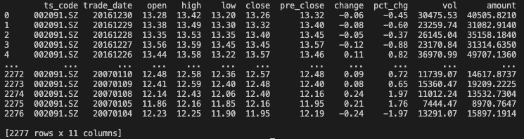

# RL_Portfolio_env

一个基于强化学习的投资组合管理环境，支持通过 Tushare 获取股票交易数据，用于训练和测试投资组合优化策略。

A reinforcement learning environment for portfolio management, supporting stock trading data acquisition through Tushare for training and testing portfolio optimization strategies.

## 项目简介(Project Overview)

本项目提供了一个符合 OpenAI Gym 标准的强化学习环境，专门用于股票投资组合管理。通过集成 Tushare 数据接口，可以方便地获取真实的股票市场数据，训练智能投资策略。

This project provides reinforcement learning environment with OpenAI Gym specifically designed for stock portfolio management. By integrating the Tushare data interface, it facilitates easy access to real stock market data for training intelligent investment strategies.

## 安装(Installation)

### 环境要求(Requirements)

- Python 3.8+
- Tushare Pro account（用于获取数据,for data acquisition)

### 安装依赖(Dependencies)

```bash
git clone https://github.com/muteyaki/RL_Portfolio_env.git
cd RL_Portfolio_env
pip install -r requirements.txt
```

### Tushare 配置(Configuration)

1. 注册 [Tushare Pro](https://tushare.pro/register) 账号 (Register for a Tushare Pro account)
2. 获取 API Token (Obtain your API Token)
3. 配置 Token：(Configure the token:)

```python
import tushare as ts
ts.set_token('your_token_here')  # See 'get_data.py'
```

The data samples could be downloaded like:




## 股票环境配置(Environment Configuration)

### 状态空间(State Space)


环境的观察空间包含：
- 股票价格历史数据（开盘价、最高价、最低价、收盘价、成交量）
- 当前持仓比例
- 可用资金比例


The observation space includes:

- Historical stock price data (Open, High, Low, Close, Volume)
- Current position weights
- Available cash ratio

\* Since the market data obtained from Tushare is organized on a daily basis, our environment is also constructed with daily state updates.

### 动作空间(Action Space)

动作空间表示投资组合的权重分配：
- **类型**：连续动作空间 `Box`
- **维度**：等于股票数量
- **范围**：[0, 1]，且所有权重之和为 1.0
- **含义**：每只股票在投资组合中的资金占比

The action space represents portfolio weight allocation:

- **Type**: Continuous action space Box
- **Dimension**: Equal to the number of stocks
- **Range**: [0, 1], with all weights summing to 1.0
- **Meaning**: Capital allocation percentage for each stock in the portfolio

## 支持的股票市场(Supported Stock Markets)

通过 Tushare 接口，支持：
- **A股市场**：上海证券交易所（.SH）、深圳证券交易所（.SZ）
- **数据类型**：日线、周线、月线数据
- **数据内容**：OHLCV（开高低收量）+ 技术指标

Through the Tushare interface, supports:

- **A-share Market**: Shanghai Stock Exchange (.SH), Shenzhen Stock Exchange (.SZ)
- **Data Types**: Daily, weekly, and monthly data
- **Data Content**: OHLCV (Open, High, Low, Close, Volume) + Technical indicators

### 股票代码格式(Stock Code Format)

```python
# 上海证券交易所 Shanghai Stock Exchange
'600000.SH'  # 浦发银行
'600036.SH'  # 招商银行

# 深圳证券交易所 Shenzhen Stock Exchange
'000001.SZ'  # 平安银行
'000002.SZ'  # 万科A
```

## 项目结构(Project Structure)

```
RL_Portfolio_env/
├── get_data.py          # Tushare 数据获取模块, Tushare data acquisition module
├── feature_extract.py   # 特征处理网络（包含LSTM，Transformer）, Feature processing network (includes LSTM, Transformer)
├── pg_basic_env.py      # 主环境类, Main environment class
├── main.py              # 主函数, Main function
├── requirements.txt     # 依赖包, Dependencies
└── README.md            # 说明文档, Documentation
```


## Contact

- Email: guoxinshimay@outlook.com
- Project URL: https://github.com/muteyaki/RL_Portfolio_env